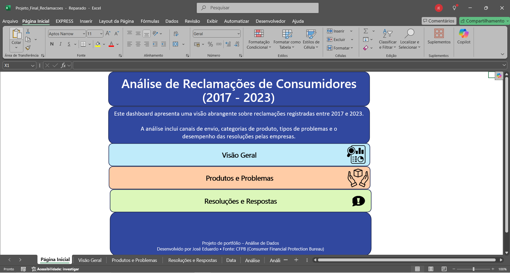
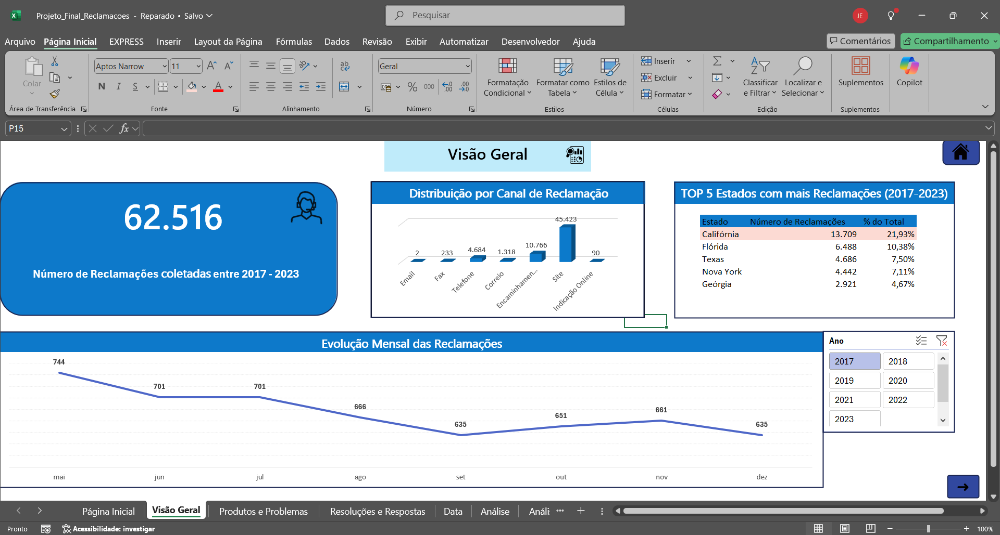
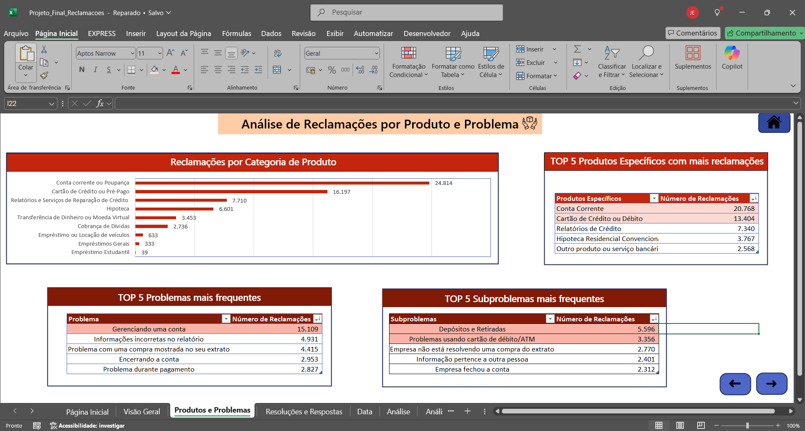
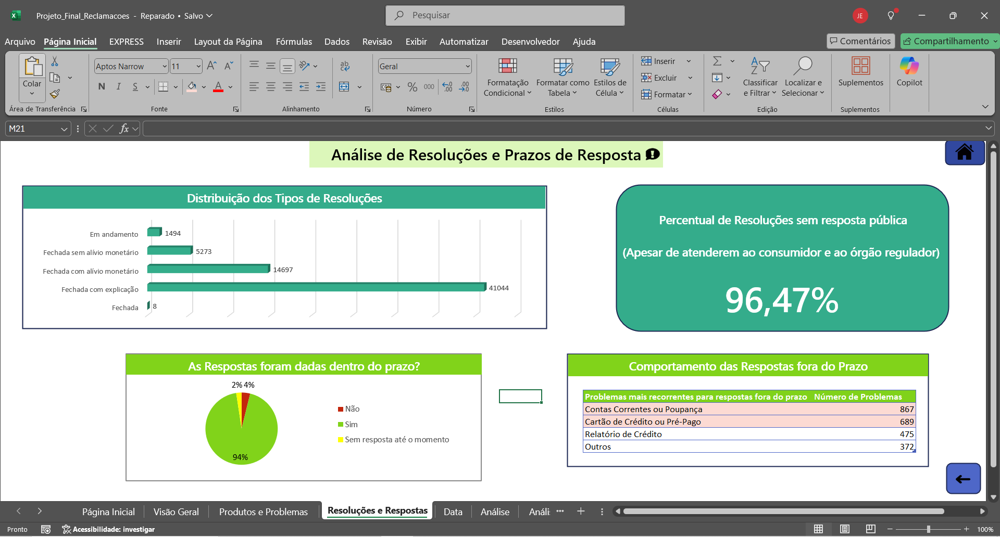

# 📢 Excel - Dashboard - Reclamações
Este dashboard apresenta uma visão abrangente sobre reclamações registradas entre 2017 e 2023.  A análise inclui canais de envio, categorias de produto, tipos de problemas e o desempenho das resoluções pelas empresas.

---

# 📌 Visão Geral

- **Ferramentas utilizadas**: Microsoft Excel
- **Foco**: Comportamento Geral das Reclamações, Produtos mais contestados, Problemas mais comuns, Resoluções mais comuns e Análise de Respostas fora do prazo
- **Produto final**: Dashboard em Excel

  ---

### 🔠 Dicionário de Dados

| Coluna                        | Descrição                                                                                                                                                                                                 |
|------------------------------|-----------------------------------------------------------------------------------------------------------------------------------------------------------------------------------------------------------|
| Complaint ID                 | Identificador único da reclamação                                                                                                                                                                        |
| Submitted via                | Canal pelo qual a reclamação foi enviada ao CFPB (ex: Web, Telefone, etc.)                                                                                                                               |
| Date submitted               | Data em que o CFPB recebeu a reclamação                                                                                                                                                                   |
| Date received                | Data em que a reclamação foi enviada para a empresa                                                                                                                                                       |
| State                        | Estado (sigla) informado pelo consumidor                                                                                                                                                                  |
| Product                      | Tipo de produto identificado na reclamação (ex: Cartão de crédito, Empréstimo, etc.)                                                                                                                    |
| Sub-product                  | Subcategoria do produto (nem todos os produtos têm subprodutos)                                                                                                                                           |
| Issue                        | Problema identificado pelo consumidor (os valores possíveis variam conforme o produto)                                                                                                                    |
| Sub-issue                    | Subproblema relacionado ao problema principal (nem todos os problemas têm subproblemas)                                                                                                                   |
| Company public response      | Resposta pública opcional da empresa, escolhida a partir de uma lista padronizada (ex: "Empresa acredita que foi um erro isolado")                                                                       |
| Company response to consumer | Resposta da empresa ao consumidor (ex: "Encerrado com explicação")                                                                                                                                        |
| Timely response?             | Se a resposta da empresa foi dada dentro do prazo (Yes/No)                                                                                                                                                |

---

  ## 🧼 Etapas do Projeto

### 1. Análise (Excel)
- Tabelas dinâmicas e análise de indicadores com funções
- Criação de aba extra para auxiliar na tradução (O dataset está em inglês)

### 2. Dashboard (Excel)
- Gráficos de linha, barras e pizza
- KPIs com caixas e ícones
- Botões Interativos para navegação no Dashboard

📊 Dashboard: [`entregas/dashboard_final.xlsx`](./dados_tratados_entrega/Projeto_Final_Reclamacoes1.xlsx)

---

## 📷 Preview do Dashboard

---

## 🎯 Insights Obtidos
- Maior parte das reclamações é realizada diretamente pelo **Site**
- **Califórnia** é o Estado que acumula mais reclamações no período de tempo analisado.
- Após a pandemia **(a partir de 2020)** as reclamações **aumentaram** consideravelmente.
- Os produtos com mais reclamações tem relação com diferentes modalidades de **Crédito**.
- Os problemas mais comuns são relacionados a **Débitos e Depósitos**.
- É comum a empresa **não fornecer uma resposta pública ao problema**.
- Dentre as **respostas fora do prazo**, **os problemas são justamente os mais comuns, analisados anteriormente**.

---

## 🔗 Sobre o Dataset
Dataset original: Financial Consumer Complaints – Maven Analytics  
Disponível em: [https://www.mavenanalytics.io/data-playground](https://www.mavenanalytics.io/data-playground)
