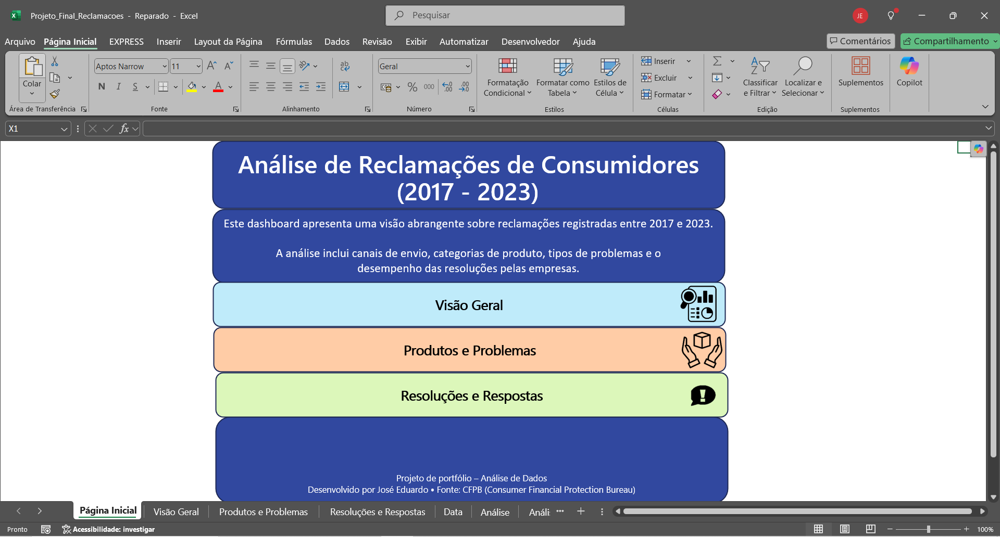
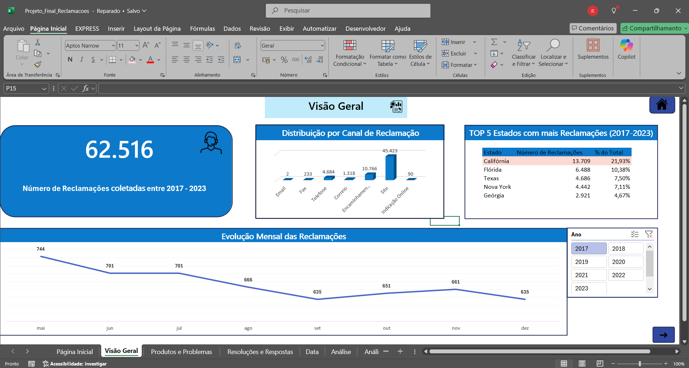
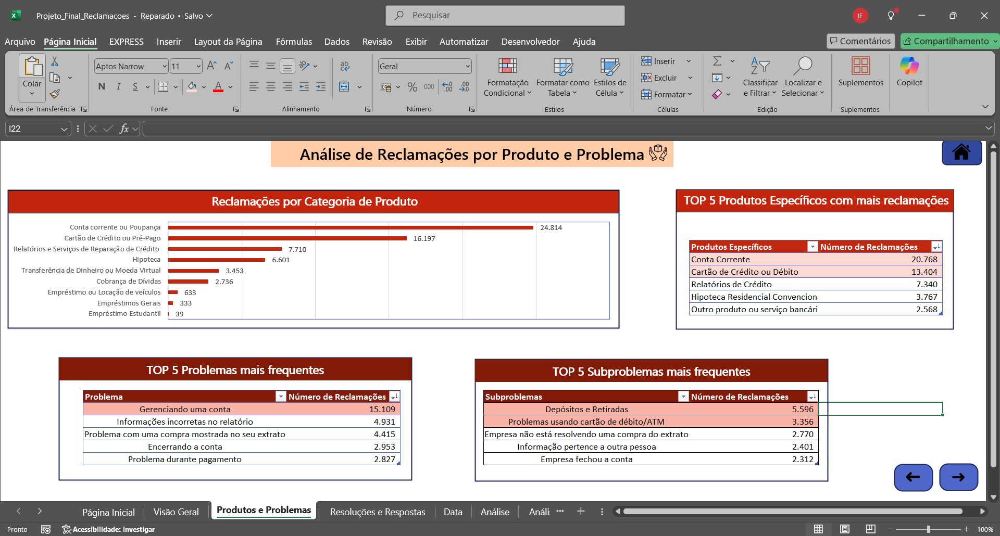
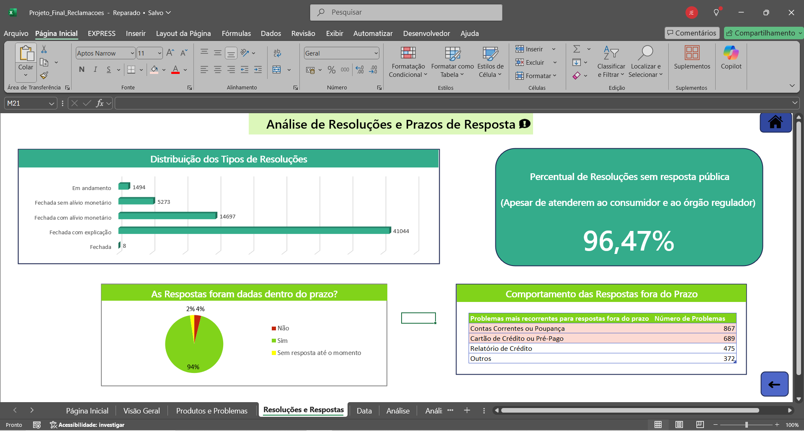

# 📢 Excel - Dashboard - Reclamações
Neste projeto, desenvolvi uma análise baseada em registros de reclamações de clientes sobre serviços bancários. A ideia foi entender padrões por canal de atendimento, tempo de resposta e produto reclamado, utilizando Excel para criação de dashboards e indicadores.

---

# 📌 Visão Geral

- **Ferramentas utilizadas**: Microsoft Excel
- **Foco**: Comportamento Geral das Reclamações, Produtos mais contestados, Problemas mais comuns, Resoluções mais comuns e Análise de Respostas fora do prazo
- **Produto final**: Dashboard em Excel

  ---
                                                                          |
## 📚 Dicionário de Dados (resumo)
Este projeto apenas uma tabela com dados gerais sobre cada reclamação.

Para o dicionário completo, veja [aqui](./dados_tratados_entrega/dicionario_reclamacoes.txt).

---

## 🧼 Etapas do Projeto

### 1. Análise (Excel)
- Uso de Power Query para verificar Distribuição e Qualidade das colunas, bem como a tipagem
- Tabelas dinâmicas e análise de indicadores com funções
- Criação de aba extra para auxiliar na tradução (O dataset está em inglês)

### 2. Dashboard (Excel)
- Gráficos de linha, barras e pizza
- KPIs com caixas e ícones
- Botões Interativos para navegação no Dashboard

📊 Dashboard: [`entregas/dashboard_final.xlsx`](./dados_tratados_entrega/Projeto_Final_Reclamacoes1.xlsx)

---

## 📷 Preview do Dashboard

---

## 🎯 Insights Obtidos
- Maior parte das reclamações é realizada diretamente pelo **Site**
- **Califórnia** é o Estado que acumula mais reclamações no período de tempo analisado.
- Após a pandemia **(a partir de 2020)** as reclamações **aumentaram** consideravelmente.
- Os produtos com mais reclamações tem relação com diferentes modalidades de **Crédito**.
- Os problemas mais comuns são relacionados a **Débitos e Depósitos**.
- É comum a empresa **não fornecer uma resposta pública ao problema**.
- Dentre as **respostas fora do prazo**, **os problemas são justamente os mais comuns, analisados anteriormente**.

---

## 🔗 Sobre o Dataset
Dataset original: Financial Consumer Complaints – Maven Analytics  
Disponível em: [www.mavenanalytics.io/data-playground](https://www.mavenanalytics.io/data-playground)
